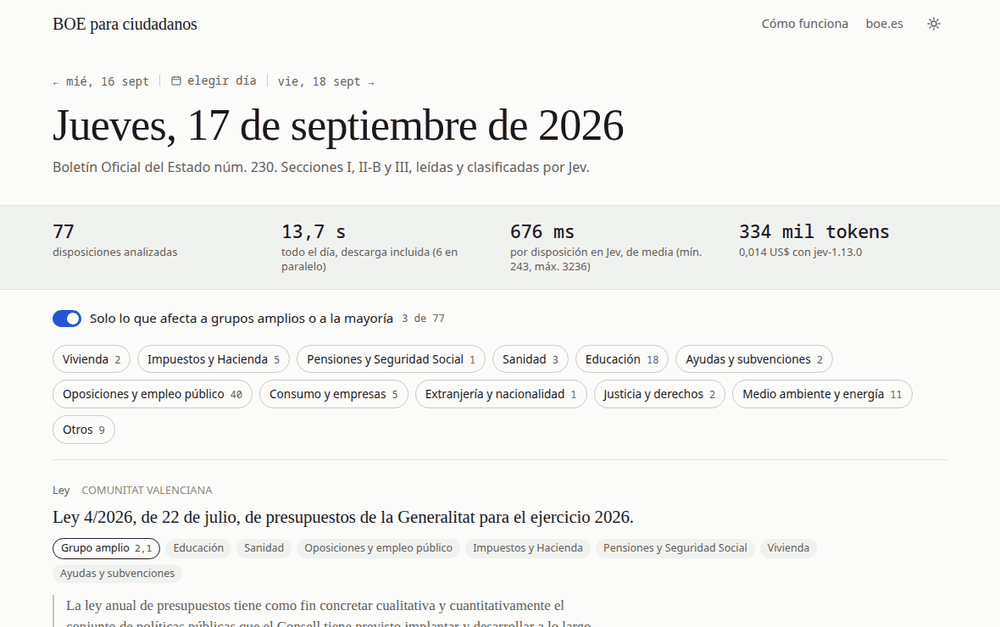

# BOE para ciudadanos

Demo de [Jev](https://docs.typesafe.ai/introduction), el modelo *System One* de TypeSafe, aplicada al Boletín Oficial del Estado.

Cada mañana un pipeline descarga el BOE del día (secciones I, II-B y III), lee cada disposición y le hace a Jev, en una sola llamada por texto, un conjunto de preguntas cerradas:

| Pregunta | Tipo | Qué devuelve |
|---|---|---|
| ¿Cuánto cambia esto para las personas corrientes? | `Score` (0-3) | Esperanza + confianza. Relevante si ≥ 2. |
| ¿Contiene una medida concreta sobre vivienda / empleo / impuestos / ...? | 13 × `Noul` | Probabilidad por categoría. Se asigna si > 0,6. |
| ¿Qué párrafo explica mejor qué cambia y para quién? | `Choice` sobre los párrafos | El párrafo elegido, literal del BOE. |
| (Oposiciones) ¿Convocatoria nueva? ¿Acceso libre? | 2 × `Noul` | Etiquetas extra. |

Jev no genera texto: solo elige, puntúa y estima probabilidades. Por eso el "resumen" de cada disposición es un párrafo original seleccionado por el modelo, no redactado por él. Se guarda la latencia real de cada llamada y el tiempo total por día para enseñar la velocidad del modelo: un BOE completo (50-80 textos, ~300k tokens) se analiza en 5-15 s con 6 llamadas en paralelo, a ~0,01 $.

La web es estática (Astro), sin login, y se sirve desde GitHub Pages. Los datos viven como JSON en `data/` dentro del repositorio.



*La web: cada disposición con su relevancia (0-3), sus categorías y el párrafo literal que Jev elige como resumen; filtros por categoría y navegación por días.*


*El pipeline, salida real: `pnpm pipeline --date 2026-09-17 --dry-run --verbose`. 77 disposiciones, 334k tokens, 6 llamadas en paralelo, menos de 10 s de reloj.*

## Uso local

```sh
pnpm install
cp .env.example .env            # y pon tu TYPESAFE_API_KEY

pnpm pipeline --today           # analiza el BOE de hoy → data/days/YYYY-MM-DD.json
pnpm pipeline --date 2026-09-17 # un día concreto (--force para reanalizar)
pnpm pipeline --backfill 7      # los últimos 7 días
pnpm pipeline --date 2026-09-17 --dry-run --verbose
                                # analiza sin escribir en data/, una línea por disposición según llega

pnpm calibrate --date 2026-09-17 --limit 15 [--section 1|2B|3] [--lang es|en] [--full]
                                # revisa a ojo categorías, extractos y scores sin escribir en data/

pnpm dev                        # web en http://localhost:4321
pnpm build && pnpm preview

pnpm demo:web                   # regraba docs/demo-web.gif (construye la web y la recorre con Chrome headless)
pnpm demo:pipeline              # regraba docs/demo-pipeline.gif (ejecuta el pipeline de verdad; ~0,01 $)
```

Los GIFs se graban con `playwright-core` sobre el Chrome del sistema y `ffmpeg`; los scripts están en `demo/`.

Los scripts del pipeline leen `TYPESAFE_API_KEY` del entorno (carga `.env` con `set -a; . ./.env; set +a` o usa tu gestor favorito).

## Despliegue en GitHub Pages

1. Sube el repositorio a GitHub (público, o privado con plan que permita Pages).
2. En **Settings → Secrets and variables → Actions** crea el secreto `TYPESAFE_API_KEY`.
3. En **Settings → Pages**, elige *Source: GitHub Actions*.
4. Lanza el workflow **BOE diario** a mano (*Actions → BOE diario → Run workflow*) o espera al cron de las 07:15 UTC de lunes a sábado.

El workflow analiza el día, hace commit de `data/`, construye la web y la publica. Los días sin BOE (domingos, festivos) terminan sin cambios. Un `push` a `main` solo reconstruye y publica la web.

La web se sirve bajo `/<nombre-del-repo>/`; el workflow calcula `BASE_PATH` y `SITE_URL` solo. Con dominio propio, cambia esas variables en `.github/workflows/daily.yml`.

## Estructura

```
pipeline/
  boe.ts         sumario JSON + XML de cada disposición → párrafos (salta el índice, recorta a 20k chars)
  questions.ts   taxonomía de categorías, rúbrica de relevancia y preguntas a Jev (en/es)
  analyze.ts     una llamada a Jev por disposición, umbrales, tiempos
  run.ts         CLI diario / backfill; escribe data/days/*.json y data/index.json
  calibrate.ts   tabla legible para ajustar preguntas y umbrales
  types.ts       tipos compartidos con la web
data/            JSON por día (es la base de datos)
src/             Astro: una página por día, filtros en cliente, sin framework de UI
demo/            grabadores de los GIFs del README (playwright-core + ffmpeg)
docs/            GIFs de demo
.github/workflows/daily.yml
```

## Ajustes

- Umbrales (`CATEGORY_THRESHOLD`, `RELEVANT_SCORE`, `LOW_CONFIDENCE`) en `pipeline/analyze.ts`. Los JSON guardan las probabilidades crudas, así que se pueden cambiar y reconstruir la web sin volver a llamar a Jev.
- Categorías y redacción de las preguntas en `pipeline/questions.ts`. Las instrucciones van en inglés (idioma principal de Jev) y el `state` en español; `--lang es` en `calibrate` permite comparar.
- Secciones analizadas en `pipeline/boe.ts` (`SECTIONS`).
